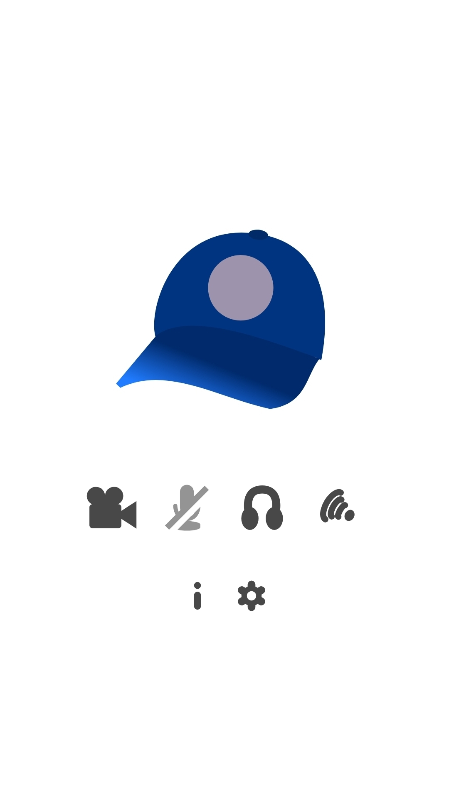
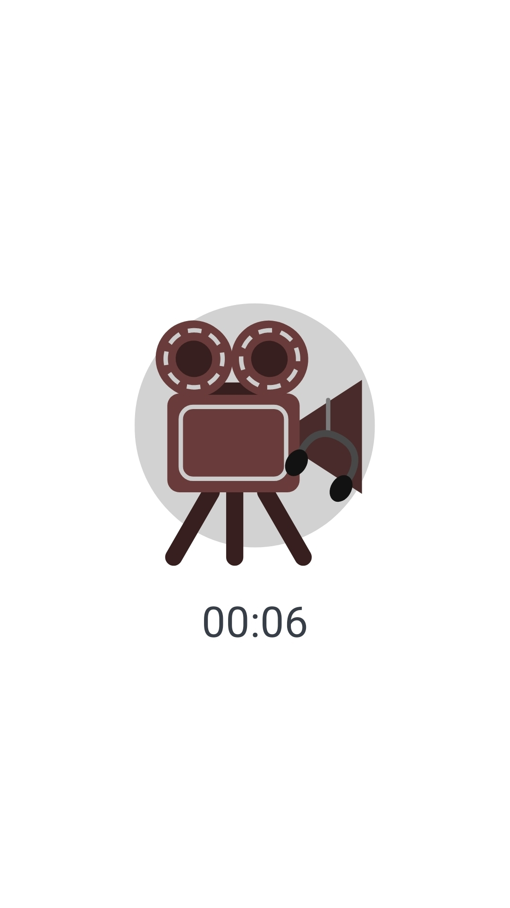
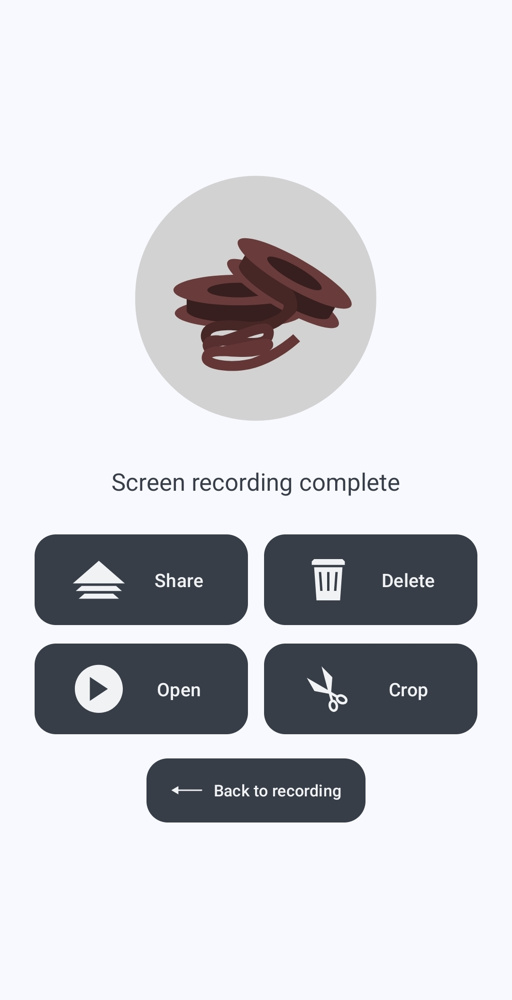

# CaptureCap
***Capture and Stream Android Screen and/or Audio.***

  

*Audio Playback recording requires Android 10 or later. No Root needed*

*(**WARNING**: Some device vendors may not allow recording certain Audio Playback sources, or even recording applications' audio at all)*

 
 

### Donations
You can support the author by donating with cryptocurrencies.

**BTC**: `bc1q6jp0g9jhrcx5l75gyg4c698yvg5qtm08j826p5`

**ETH**: `0x7b3E49fd98D64E965a4F26F67C236Dc80C31766D`

**USDT**: `TNfBpVveyvDBYCUvScFQKjjXgUXqJiyRDk`

**Monero**: `87Yt5dCNEoEb3WhpfgjUhGFSJMgPaPhb65jMaDLLoyZ4DEBFx62AGzYVii3tzEfqBz8c3HXJ8QyjM9KASh1iRoqpPLAdN7r`

